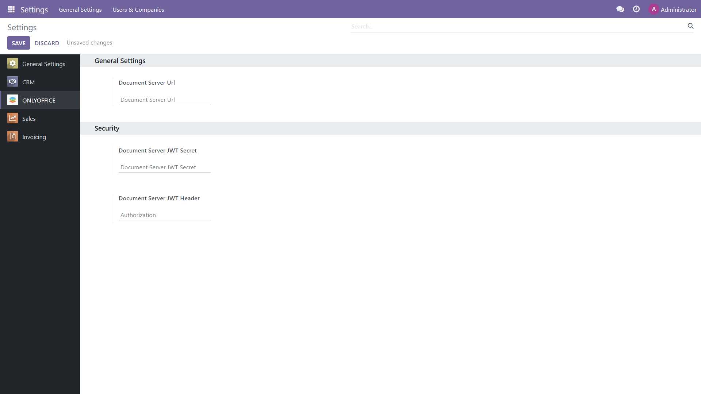

Prerequisites
=============

To be able to work with office files within Odoo, you will need an instance of ONLYOFFICE Docs. You can install the `self-hosted version`_ of the editors (free Community build or scalable Enterprise version), or opt for `ONLYOFFICE Docs`_ Cloud which doesn't require downloading and installation.

ONLYOFFICE app configuration
============================

After the app installation, adjust its settings within your Odoo (*Home menu -> Settings -> ONLYOFFICE*).
In the **Document Server Url**, specify the URL of the installed ONLYOFFICE Docs or the address of ONLYOFFICE Docs Cloud.

**Document Server JWT Secret**: JWT is enabled by default and the secret key is generated automatically to restrict the access to ONLYOFFICE Docs. if you want to specify your own secret key in this field, also specify the same secret key in the ONLYOFFICE Docs `config file`_ to enable the validation.

**Document Server JWT Header**: Standard JWT header used in ONLYOFFICE is Authorization. In case this header is in conflict with your setup, you can change the header to the custom one.

Contact us
==========

If you have any questions or suggestions regarding the ONLYOFFICE app for Odoo, please let us know at https://forum.onlyoffice.com

.. _self-hosted version: https://www.onlyoffice.com/download-docs.aspx
.. _ONLYOFFICE Docs: https://www.onlyoffice.com/docs-registration.aspx
.. _config file: https://api.onlyoffice.com/editors/signature/